---

layout: home
title: Filters
permalink: /filters/
nav_order: 1

---
# [**1. Unix Filters**](downloads/filters.pdf)

<hr style="height: 3px; background-color: black; border: none;"><br>

## **Using Filters**
Shell I/O redirection can be used to specifiy filter source and destination files:
```shell 
$ filter < input.txt > output.txt
$ < input.txt filter > output.txt
$ < input.txt > output.txt filter
```

Alternatively, most filters allow input files to be specified as arguments:
```shell
$ filter input1.txt input2.txt input3.txt > output.txt
```

Filters normally used in combination via pipeline
```shell
filter1 | filter2 | ... | filterN
```


## **More about Process Substitution (AKA pipes)**


<hr style="height: 3px; background-color: black; border: none;"><br>

## **Simplest Filter: `cat`**
- cat command copies its input to output unchanged (identity filter).
- cat - given filenames, concatenates them onto stdout.
- cat - given no filenames, copies stdin to stdout unchanged

### **`cat` Options**
Write `cat --help` to see options \
Useful Options:
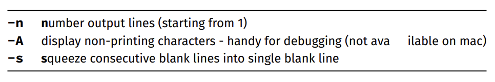
- See also: the `tac` command - which reverses the order of lines.
```shell
$ tac
hello
hi
there
there
hi
hello
```
- See also: the `rev` command - which reverses the order of characters in lines.
```shell
hello
olleh
```

In C:
```c
// write bytes of stream to stdout
void process_stream(FILE *stream) {
    int byte;
    while ((byte = fgetc(stream)) != EOF) {
        if (fputc(byte, stdout) == EOF) {
            perror("cat:");
            exit(EXIT_SUCCESS);
        }
    }
}

// process files given as arguments
// if no arguments process stdin
int main(int argc, char *argv[]) {
    if (argc == 1) {
        process_stream(stdin);
    } else {
        for (int i = 1; i < argc; i++) {
            if (!strcmp(argv[i], "-")) {
                process_stream(stdin);
            } else {
                FILE *in = fopen(argv[i], "r");
                if (in == NULL) {
                    fprintf(stderr, "%s: %s: ", argv[0], argv[i]);
                    perror("");
                    return EXIT_FAILURE;
                }
                process_stream(in);
                fclose(in);
            }
        }
    }

    return EXIT_SUCCESS;
}
```
<hr style="height: 3px; background-color: black; border: none;"><br>
## **Selecting Lines Containing a String `grep`**
### **`grep` Options**
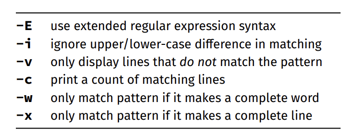
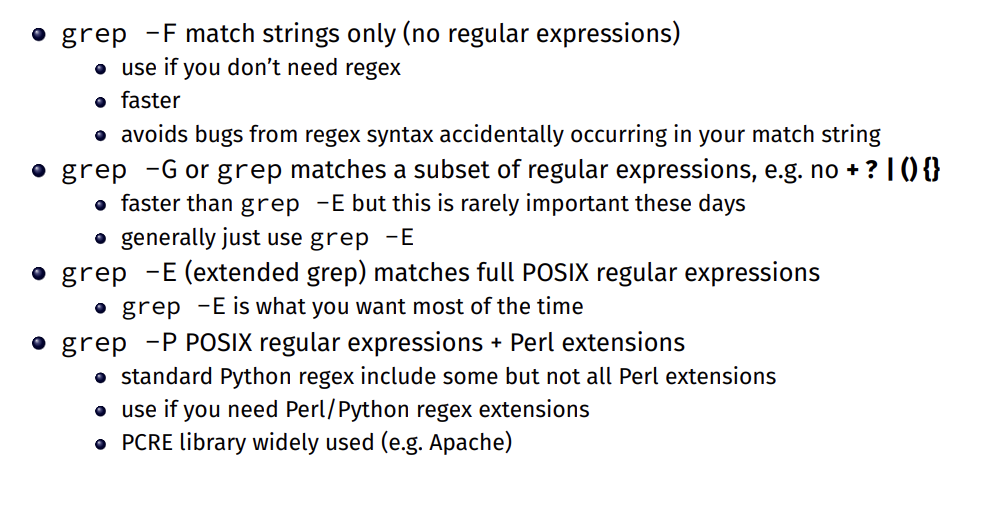

Tip: Add in '' (Use double quotes instead "") so don't run shell command before union |
```shell
$ grep -E -c 'Eliza|Lizzie' pride_and_prejudice.txt
$ grep --colour=auto -E -c 'Eliza|Lizzie' pride_and_prejudice.txt

# can use (?1)? which causes a mirror/recursive effect 
$ grep -P '^B*(A(?1)?B)$' input.txt
AAABBB
AB
AABB
```

In Python:
```py
import sys

def process_stream(f, name, substring):
    """
    print lines containing substring
    equivalent to `grep -FHn`
    """
    for (line_number, line) in enumerate(f, start=1):
        if substring in line:
            print(f'{name}:{line_number}:{line}', end='')


def main():
    """
    process files given as arguments, if no arguments process stdin
    """
    if len(sys.argv) == 1:
        # Only one CLI arg, need something to look through
        sys.exit(f"Usage: {sys.argv[0]} <NEEDLE> [FILE]...")
    elif len(sys.argv) == 2:
        # Two CLI args, take in sys.argv[1] to match, stdin is file to look through
        process_stream(sys.stdin, "<stdin>", sys.argv[1])
    elif len(sys.argv) > 2:
        # more than 2: take in sys.argv[1] to match, rest are files to look through for matches
        for pathname in sys.argv[2:]:
            with open(pathname, 'r') as f:
                process_stream(f, pathname, sys.argv[1])


if __name__ == '__main__':
    main()
```
<hr style="height: 3px; background-color: black; border: none;"><br>
## **Regular Expressions**
### **Basics**
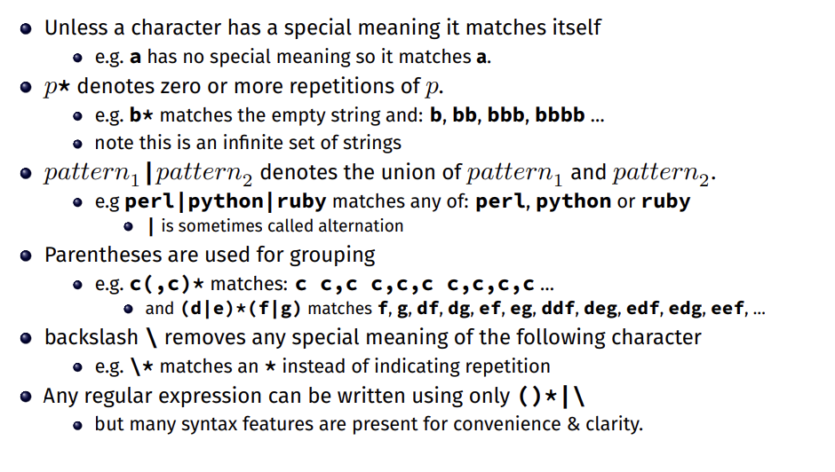

### **Matching Single Chars**
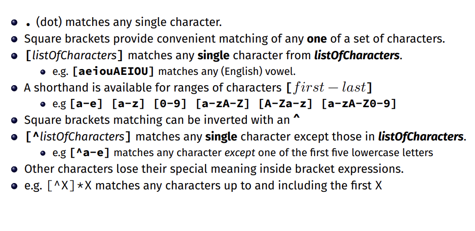

### **Anchoring Matches**
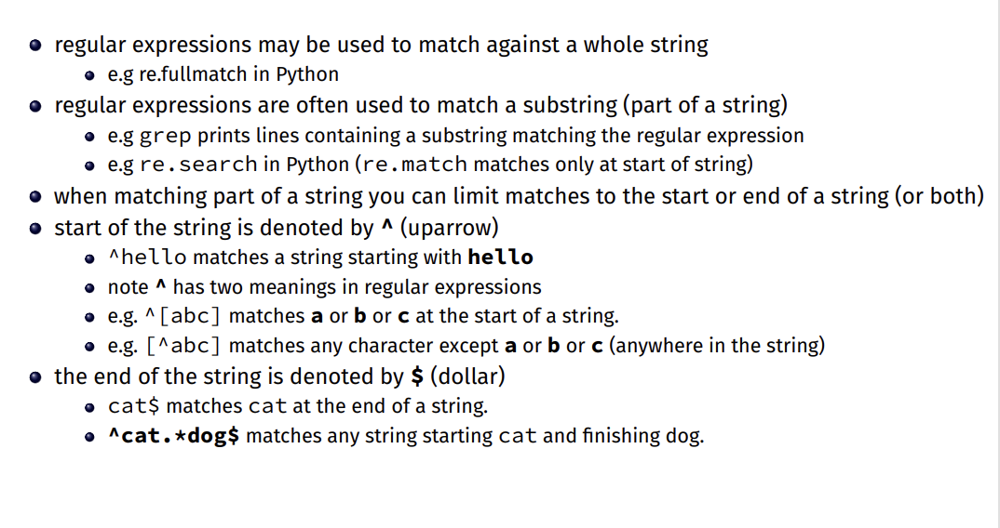

### **Repetition**
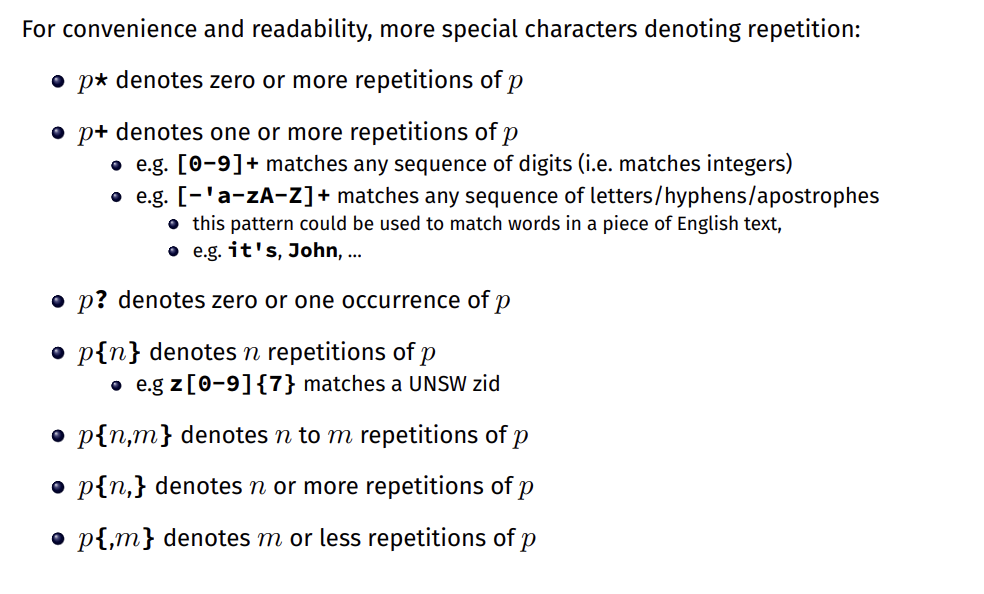

### **Tips**
- To get lines with nothing: ^$
- Whitespace, including tab characters: \s or ([ \t])
- 

Websites:
[Regex101](https://regex101.com)
[RegexR](https://regexr.com)

<hr style="height: 3px; background-color: black; border: none;"><br>

## **`wc`: word counter**
- default: prints number of line, words, bytes in input <br><br>
Useful Options: 
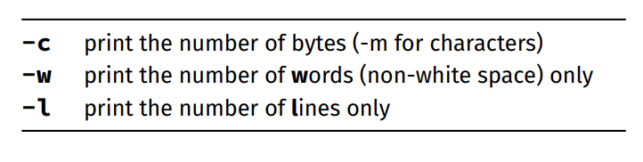

e.g
```shell
$ wc /etc/passwd
49 79 2793 /etc/passwd

$ wc pride_and_prejudice.txt
14533 127377 751479 
# lines words bytes
```

```py
    def process_stream(pathname, stream):
    """
    count lines, words, chars in stream
    """
    lines = 0
    words = 0
    characters = 0
    for line in stream:
        lines += line.endswith(os.linesep)
        words += len(line.split())
        characters += len(line)
    print(f"{lines:>6} {words:>6} {characters:>6} {pathname}")
```

<hr style="height: 3px; background-color: black; border: none;"><br>
## **`tr`: transliterate chars**
- old: reads & writes chars, mapping (replacing) some chars with others
- `tr sourceChars destChars`
- each char in `sourceChars` is mapped to corresponding char in `destChars`
- can't give files to `tr` only stdin but can pass via stdin
- not line based, works with individ chars

e.g 
```shell
$ tr aeiou 12345
Hello comp2041 how are you doing
H2ll4 c4mp2041 h4w 1r2 y45 d43ng

$ cat pride_and_prejudice.txt | tr aeiou 12345
# can reverse
$ cat pride_and_prejudice.txt | tr aeiou 12345 | tr 12345 aeiou
# can use shortcuts
$ tr a-zA-Z b-zB-ZA
cat
dbu
DOG
EPH

$ tr a-zA-Z b-zB-ZA < pride_and_prejudice.txt | more
```

Useful Options:
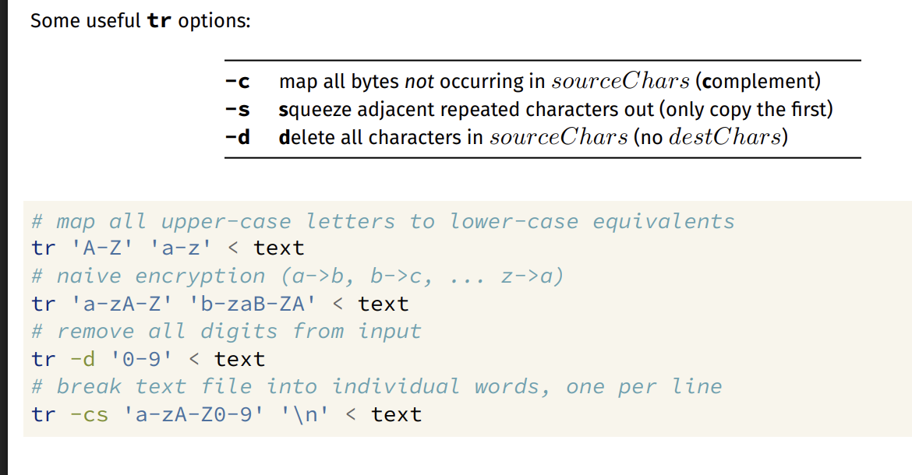

- -s: squeezes adjacent occurring characters down to 1 `tr "a" "b"` squeezes `aaaaa` to `b`

<hr style="height: 3px; background-color: black; border: none;"><br>
## **`head/tail`: select first/last lines**
- head: prints first `n` (default 10) lines of input
- tail prints last `n` lines of input

```shell
$ head -n 100 pride_and_prejudice.txt
$ tail -n 100 pride_and_prejudice.txt
# get range
$ head -n 100 pride_and_prejudice.txt | tail -n 200 pride_and_prejudice.txt
```

<hr style="height: 3px; background-color: black; border: none;"><br>
## **`cut`: vertical slice**
Useful Options:
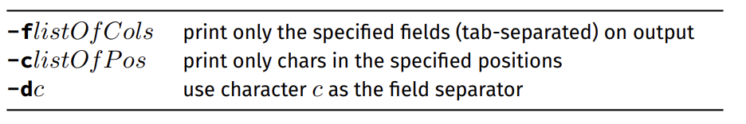

- Remember to add '' around delimiter char
- `cut -d'|' -f-3 data` 
- cannot refer to last column without counting columns
- cannot reorder columns but very efficient

```shell
# gets chars 20-40 and 60-80 per line
$ cut -c20-40,60-80 pride_and_prejudice.txt
# gets chars 24 and 42 per line
$ cut -c24,42 pride_and_prejudice.txt

# print the first column
$ cut -f1 data
# print the first three columns
$ cut -f1-3 data
# print the first and fourth columns
$ cut -f1,4 data
# print all columns after the third
$ cut -f4- data
# print the first three columns, if '|'-separated
$ cut -d'|' -f-3 data
# print the first five chars on each line
$ cut -c1-5 data

$ cut -d'|' -f1,3 enrollments.psv |grep -E '^COMP(2041|9044)'|cut -d'|' -f2 |grep Anna
# can always |head to double check pipes
```

<hr style="height: 3px; background-color: black; border: none;"><br>
## **`sort`: sort lines**
Useful Options:
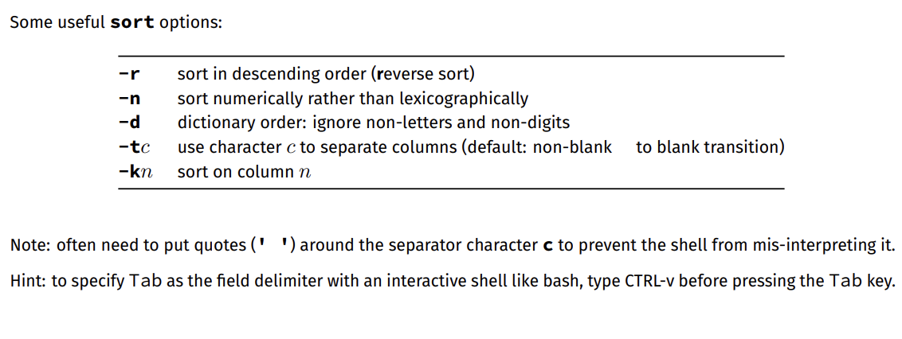

```shell
# sort numbers in 3rd column in descending order
sort -nr -k3 data
# sort the password file based on user name
sort -t: -k5 /etc/passwd
```

Python
```py
def process_stream(f):
    """
    print lines of stream in sorted order
    """
    print("".join(sorted(f)), end="")
def main():
    """
    process files given as arguments, if no arguments process stdin
    """
    if len(sys.argv) == 1:
        process_stream(sys.stdin)
    else:
        with open(sys.argv[1], 'r') as f:
            process_stream(f)


if __name__ == '__main__':
    main()
```

Tips: 
- can specify stopping at certain characters using `-k1.5,1.8`
- also when stating fields, need to specify start and stop
```shell
$ sort -t'|' -k1.5,1.8 -k2,2nr enrollments.txt
```

<hr style="height: 3px; background-color: black; border: none;"><br>
## **`uniq`: remove or count duplicates**
- remove all but one copy of **adjacent** identical lines
- often preceded by `cut` and `sort`
- e.g can remove all but 1 instance of one given name

Useful Options:
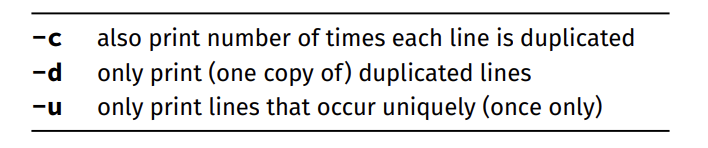

```shell
# extract first field, sort, and tally
$ cut -f1 data | sort | uniq -c
$ cut -d' ' -f1 access_log.txt|cut -d. -f1-3|sort|uniq -c| sort -nr|head
```

Python: no memory management
```py
def process_stream(stream):
    """
    copy stream to stdout except for repeated lines
    """
    last_line = None
    for line in stream:
        if last_line is None or line != last_line:
            print(line, end='')
        last_line = line

def main():
    """
    process files given as arguments, if no arguments process stdin
    """
    if not sys.argv[1:]:
        process_stream(sys.stdin)
    else:
        for pathname in sys.argv[1:]:
            with open(pathname, 'r') as f:
                process_stream(f)


if __name__ == '__main__':
    main()
```

<hr style="height: 3px; background-color: black; border: none;"><br>
## **`sed`: stream editor**
- works with streams of chars
- How it works:
    - reads each line of input
    - check if matches any patterns or line-ranges
    - apply related editing commands to the line
    - write the transformed line to output
- partition lines based on patterns rather than cols
- extract ranges of lines based on patterns or line numbers

e.g
```shell
$ sed -E 's/cat|dog/eel/'
$ sed -E -n '/eel/p'
$ sed -E '1,10s/eel/cat/'

# print all lines
$ sed -n 'p' < file
# print the first 10 lines
$ sed '10q' < file
$ sed -n '1,10p' < file
#print lines 81 to 100
$ sed -n '81,100p' < file
#print the last 10 lines of the file?
$ sed -n '$-10,$p' < file # does NOT work

# print only lines containing 'xyz'
$ sed -n '/xyz/p' < file
# print only lines NOT containing 'xyz'
$ sed '/xyz/d' < file
# show the passwd file, displaying only the
# lines from "root" up to "nobody" (i.e. system accounts)
$ sed -n '/^root/,/^nobody/p' /etc/passwd
# remove first column from ':'-separated file
$ sed 's/[^:]*://' datafile
# reverse the order of the first two columns
$ sed -E 's/([^:]*):([^:]*):(.*)$/\2:\1:\3/'
```

### **Useful Options:**
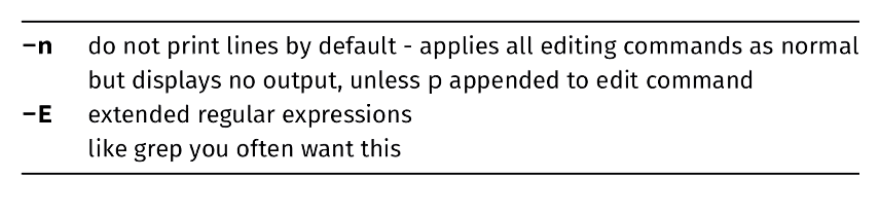
- option -g: global- all occurrences in single line are replaced

### **Editing Commands:**
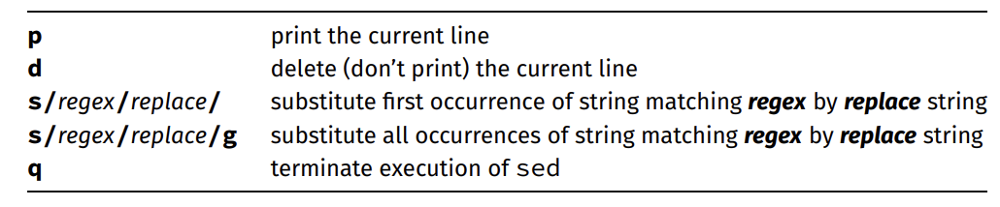
- most of the time use `s`
- to use multiple add /
    - e.g `$ sed -E '/Darcy|Elizabeth/d' pride_and_prejudice.txt`

### **Line Addresses/Line Selector Patterns**
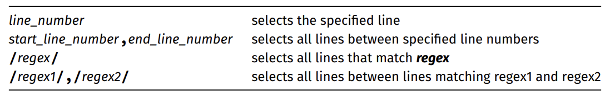

### **Change a file with `sed`**
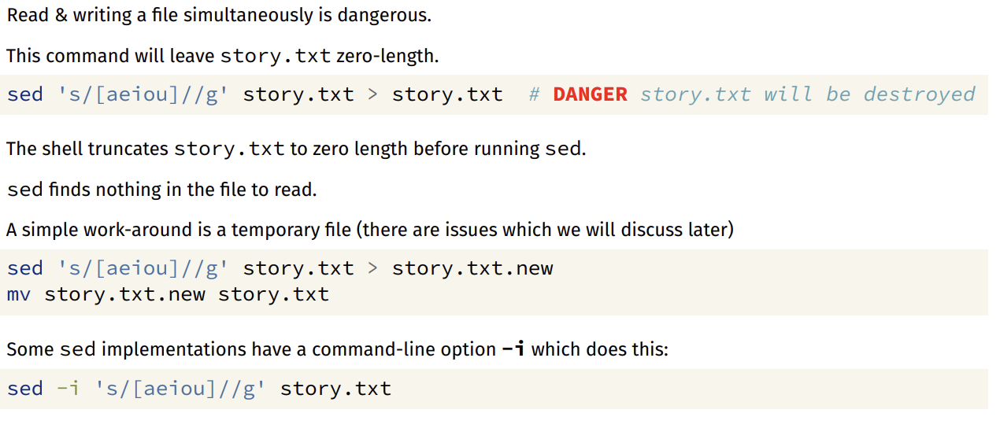

### **Capturing and Reordering using `sed`**
```shell
# use () to capture, \1 to use what was captured in brackets
# up to 9 captures allowed
$ sed -E 's/([aeiou])/-\1@/g'

# taking name from enrollments, and swapping last and first name
$ grep -E 'COMP(2041|9044)' enrollments.psv |cut -d'|' -f3|sort|sed -E 's/(.*), (.*)/\2 \1/'|head
Evan Abbas
Haoyang Abbas
Hugo John Will Abbas

# can add sed command onto another via ';'
$ cat story.txt|tr A-Z a-z |tr ' ' '\n'|sed 's/[^a-z]//g;/^$/d'|sort|uniq -c|sort -rn|head -n 10
...
```


<hr style="height: 3px; background-color: black; border: none;"><br>
## **`find`: search for files**
- based on properties:
    - entire directory trees
    - takes actions for all matching files 
        - default action is to print filename
    -  `find` directories tests actions
        - tests: examine file properties like name, type, modification date
        - actions: 
            - print name `-name`
            - execute command on matched file `-exec`
            - specify type whether directory or file `-type`
            - filter files based on when data modified `mtime`

```shell
# find all the HTML files below /home/z5234567/public_html
$ find /home/z5234567/public_html -name '*.html'
# find all your files/dirs changed in the last 2 days
$ find ~ -mtime -2
# show info on files changed in the last 2 days
$ find ~ -mtime -2 -type f -exec ls -l {} \;
# show info on directories changed in the last week
$ find ~ -mtime -7 -type d -exec ls -ld {} \;
#find directories either new or '07' in their name
$ find ~ -type d \( -name '*07*' -o -mtime -1 \)
# find all new HTML files below ~/public_html
$ find ~/public_html -name '*.html' -mtime -1
# find background colours in my HTML files
$ find ~/public_html -name '*.html' -exec grep -H 'bgcolor' {} \;
# above could also be accomplished via ...
$ grep -r 'bgcolor' ~/public_html
# make sure that all HTML files are accessible
$ find ~/public_html -name '*.html' -exec chmod 644 {} \;
#remove any really old files ... Danger!
$ find /home/andrewt -type f -mtime +364 -exec rm {} \;
$ find /home/andrewt -type f -mtime +364 -ok rm {} \;
```


<hr style="height: 3px; background-color: black; border: none;"><br>
## **`join`: database operator**
- merges 2 files using vals in field in each file as common key
- needs to be sorted in said field

Useful Options:


```shell
$ cat data1
Bugs Bunny 1953
Daffy Duck 1948
Donald Duck 1939
Goofy 1952
Mickey Mouse 1937
Nemo 2003
Road Runner 1949

$ cat data2
Warners Bugs Bunny
Warners Daffy Duck
Disney Goofy
Disney Mickey Mouse
Pixar Nemo

# -t' ': indicates delimiter is ' ' 
# -2 2 in second file uses 2nd field to join
# default: first file uses 1st field
# -a 1: print unpairable lines, e.g Donald Duck 1939
# e.g Bugs in data1 matches with Bugs in data2, so joins two lines, puts data1 data first, then data2
$ join -t' ' -2 2 -a 1 data1 data2
Bugs Bunny 1953 Warners
Daffy Duck 1948 Warners
Donald Duck 1939
Goofy 1952 Disney
Mickey Mouse 1937 Disney
Nemo 2003 Pixar
Road Runner 1949

# -e option: fills in missing field with '', needs o option included to work
# -o auto: structure
$ join -a1 -a2 -e '--' -t'|' -1 1 -2 1 COMP1511.txt -o auto COMP2041.txt
4200549|--|92
4201259|--|91
4203704|--|48
4207416|76|56
4209182|96|70
4209669|--|71
4212240|59|--
4213591|--|49
```

<hr style="height: 3px; background-color: black; border: none;"><br>
## **`paste`: combine files**

```shell
# assume "data" is a file with 3 tab-separated columns
cut -f1 data > data1
cut -f2 data > data2
cut -f3 data > data3
paste data1 data2 data3 > newdata
#"newdata" should look the same as "data"
```

<hr style="height: 3px; background-color: black; border: none;"><br>
## **`tee`: send copy of pipeline to file**
- a useful debugging trick is tee /dev/tty to divert a copy of a pipeline to the terminal

```shell
$ echo Hello Andrew | tee copy.txt
Hello Andrew
$ cat copy.txt
Hello Andrew
```


<hr style="height: 3px; background-color: black; border: none;"><br>
## **`xargs`: run commands with arguments from standard input**
Useful Options:


E.g
```shell
# remove home directories of users named Andrew:
grep Andrew /etc/passwd | cut -d: -f6 | xargs rm -r

# run make in every sub-directory below /usr/src/
# with a Makefile, run up to 8 make's in parallel -P8, @ acts as temp placeholder for args
find /usr/src -name Makefile | sed 's/Makefile//' | xargs -P8 -i@ make -C @
```

In Python
```py
import subprocess
import sys
# the real xargs runs the command multiple times if input is large
# the real xargs treats quotes specially
def main():
    input_words = [w for line in sys.stdin for w in line.split()]
    command = sys.argv[1:]
    subprocess.run(command + input_words)
```


<hr style="height: 3px; background-color: black; border: none;"><br>
